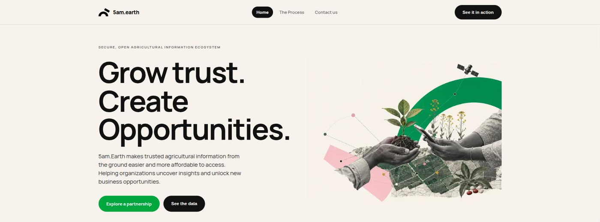

<p align="center">
  
</p>

<h1 align="center">5am.earth</h1>

<p align="center">
  <strong>Secure, open agricultural information ecosystem.</strong><br>
  Verified farmer and field information, made reusable across the agricultural value chain.
</p>

<p align="center">
  <a href="https://5am.earth/"></a>
  
  
  
</p>

---

## Live links

**Deployed:** 21 September 2026 - the release that replaced the original
hand-written site with this Next.js application.

### Production - [5am.earth](https://5am.earth/)

| Page         | URL                               |
| ------------ | --------------------------------- |
| Home         | <https://5am.earth/>              |
| The Process  | <https://5am.earth/process/>      |
| Contact      | <https://5am.earth/contact/>      |
| Partners     | <https://5am.earth/partners/>     |
| Case Studies | <https://5am.earth/case-studies/> |
| Use Cases    | <https://5am.earth/use-cases/>    |
| Team         | <https://5am.earth/team/>         |

### Standalone pages

Self-contained documents served straight from `public/`. They are **unlisted** -
nothing on the site links to them, so they are reachable only by their URL, but
they are public to anyone who has it.

| Document                             | URL                                                 | Size   |
| ------------------------------------ | --------------------------------------------------- | ------ |
| Donor Briefing 2026                  | <https://5am.earth/5am-earth-editorial-design.html> | 6.1 MB |
| Cardano proposal - Executive Summary | <https://5am.earth/cardano-proposal.html>           | 0.5 MB |
| Cardano proposal - Japanese          | <https://5am.earth/cardano-proposal-ja.html>        | 0.5 MB |

### Staging - [aiquant-tech.github.io/5am.earth-staging](https://aiquant-tech.github.io/5am.earth-staging/)

The same codebase, served from a sub-path. Every page above has a staging twin,
for example
<https://aiquant-tech.github.io/5am.earth-staging/process/> and
<https://aiquant-tech.github.io/5am.earth-staging/cardano-proposal.html>.

|            | Repo                             | Served at                                           |
| ---------- | -------------------------------- | --------------------------------------------------- |
| Production | `AIQUANT-Tech/5am.earth`         | `https://5am.earth/`                                |
| Staging    | `AIQUANT-Tech/5am.earth-staging` | `https://aiquant-tech.github.io/5am.earth-staging/` |

---

## What this is

A Next.js 14 App Router site built as a **static export** (`output: "export"`)
and published to GitHub Pages. There is no server and no database - page content
lives in `content/site.json`, and the contact form posts to a Google Apps Script
endpoint.

```
app/              routes (App Router) + globals.css
components/       SiteHeader, SiteFooter, ContactForm, DemoModal, …
content/          site.json - all copy, images and section settings
lib/              content.ts (loader + CSS helpers), imageLoader.ts
public/           fonts, images, and the standalone HTML documents
scripts/          optimize-images.py - WebP + responsive width ladder
docs/             README assets
```

## Running it locally

```bash
npm install
npm run dev              # http://localhost:3000
```

To preview exactly what gets deployed, build and serve the export:

```bash
npm run build
cd out && python3 -m http.server 8101     # http://localhost:8101/
```

> **Never run `npm run build` while `npm run dev` is running.** Both write to
> `.next`, and the dev server will start throwing `Cannot find module './948.js'`.
> Stop dev first, then `rm -rf .next`.

## How it deploys

Pushing to `main` triggers `.github/workflows/pages.yml`, which runs `npm ci`,
`npm run build`, adds `.nojekyll`, and publishes `out/` to GitHub Pages. Takes
about 2–3 minutes. Changes to `README.md` alone do not trigger a deploy.

The two environments differ by exactly one environment variable,
`NEXT_PUBLIC_BASE_PATH` - unset in production (domain root), set to
`/5am.earth-staging` on staging. See **§14** of [DEPLOYMENT.md](DEPLOYMENT.md).

## Documentation

[**DEPLOYMENT.md**](DEPLOYMENT.md) is the operational reference - where the
contact email addresses live, running the image optimizer before committing,
why the font is WOFF2, the headline-sizing trap, how to measure performance
properly, adding standalone HTML pages, and the promotion procedure.

## History

The original hand-written site that served `5am.earth` until 21 September 2026
is preserved on the **`archive-2026-09-21`** branch. Nothing from it is live
except the two Cardano proposal pages, which were carried across into `public/`
so their URLs keep working.
